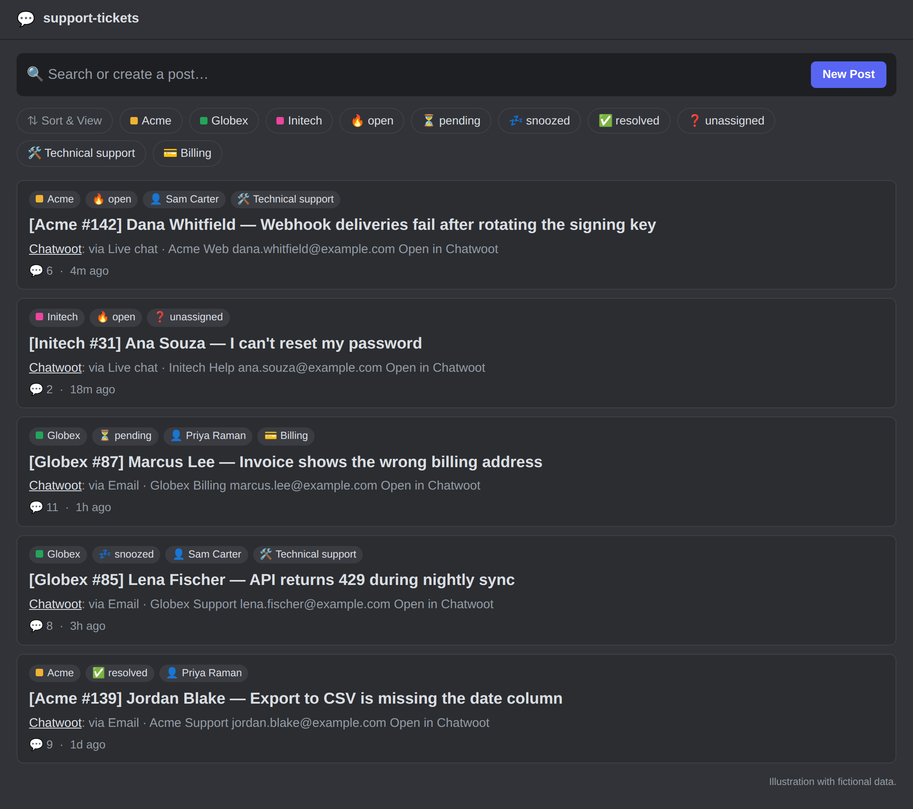

# chatwoot-discord

[](https://github.com/Phala-Network/chatwoot-discord/actions/workflows/ci.yml)
[](https://github.com/Phala-Network/chatwoot-discord/actions/workflows/codeql.yml)
[](https://scorecard.dev/viewer/?uri=github.com/Phala-Network/chatwoot-discord)
[](LICENSE)

Mirror every [Chatwoot](https://www.chatwoot.com/) conversation into a Discord forum post, and
answer customers from Discord with slash commands.

**For** support teams that already work in Discord and use Chatwoot as their help desk, and who
want humans and an AI agent to handle tickets together without leaving Discord. It runs on
Cloudflare Workers (the Free plan is enough).

> [!NOTE]
> An independent, community-maintained integration. It is not affiliated with, endorsed by, or
> supported by Chatwoot or Discord.

**Status:** in production use. Versions are `0.x`: per [SemVer](https://semver.org/#spec-item-4),
a minor release may change configuration or setup; the [changelog](CHANGELOG.md) says what to
do when it does.

[](https://deploy.workers.cloudflare.com/?url=https://github.com/Phala-Network/chatwoot-discord)



*Illustration with fictional data.*

## How it works

```
Chatwoot ──webhook──▶ Worker ──▶ Hub Durable Object ──▶ Discord forum post (via webhook)
Discord ─/command───▶ Worker ──▶ Hub Durable Object ──▶ Chatwoot REST API (as that agent)
Cron (every 5 min) ─▶ Worker ──▶ Hub Durable Object ──▶ sweep: repair anything missed
```

- Each conversation gets one forum post, titled `[<Account> #<id>] <customer> — <subject or first message>`.
  It opens with a ticket header (channel, inbox, customer email, phone number on phone channels,
  "Open in Chatwoot" link), every message follows under its sender's name (customers, agents,
  🔒 private notes, activity lines), and it ends with the ticket's card: its status, assignee, and
  labels, with buttons to act on it.
- Forum tags follow the conversation: account, status (`Open`, `Pending`, `Snoozed`,
  `Resolved`), assignee or `Unassigned`, topic, priority, and labels. Resolved posts are archived.
- Agents answer inside the post with `/reply`, `/note`, `/resolve`, `/assign`, `/label`, and
  [other commands](#commands). Each runs in Chatwoot as the agent who used it.
- Customer messages ping the linked assignee, and an optional AI agent (a Discord bot) is called
  on each of them and posts a draft; a human sends it with **Apps → Reply with this**.
- Optionally, every hour a message lists the tickets waiting for a reply or without an assignee,
  pings their assignees, and escalates long-unassigned ones to a role ([support queue](#support-queue)).
- Optionally, a new ticket is assigned to its owner and given a topic by
  [TypeSafe Jev](https://docs.typesafe.ai), a classifier, when it is confident enough
  ([routing](#routing)).

## Deploy

You need a Cloudflare account, a Chatwoot instance (v4.18 or later) reachable from the internet,
and a Discord server where you can add an application and a forum channel.

1. [Create the Discord application and forum](#1-discord).
2. [Prepare Chatwoot](#2-chatwoot): a relay user, the link attribute, and each agent's token.
3. [Deploy the Worker](#3-cloudflare) with the **Deploy to Cloudflare** button at the top or from a checkout: the secrets,
   and `CONFIG` in `wrangler.jsonc`.
4. [Connect them](#4-connect): the Discord interactions URL, the commands, and the Chatwoot
   webhooks.

## Design

- **Chatwoot stays the system of record.** Customers, channels, history, and CSAT live in
  Chatwoot; Discord is where the team, people and bots alike, works. One post per conversation
  gives humans and an AI agent the whole ticket in one thread.
- **An AI agent joins without code changes.** Each new customer message ends with a literal
  `<@bot>` mention of the bot set in `triage.userId`. Discord bots commonly react to other bots'
  messages only when mentioned inline, so the agent wakes up for customer messages and nothing
  else: agent replies, private notes, and activity lines carry no mention. The relay's
  `allowed_mentions` suppresses the notification, so the token pings no human.
- **Cost and abuse are bounded.** At most `triage.perConversationPerHour` (5) customer messages
  per conversation and `triage.perHour` (30) in total call the agent each hour; beyond that a
  visible note replaces the mention. Messages from blocked contacts are never relayed.
- **The AI drafts, humans send.** Talking in a post never reaches the customer; only commands do.
  The agent writes its proposed reply as the last fenced code block of its answer. A human uses
  **Apps → Reply with this** to open the reply editor prefilled with it, edits if needed, and
  submits. Every action runs with the human's own Chatwoot token, so Chatwoot's permissions and
  audit trail apply.
- **Links work both ways, for machines too.** The post URL is stored in the conversation's link
  attribute (`relay.linkAttribute`, default `discord_thread`), so anything that reads Chatwoot's
  API (for example a queue digest) can link to the post; the ticket header links back to Chatwoot.
- **Reliable by construction.** Chatwoot sends each account webhook once, with a short timeout
  and no retry (`lib/webhooks/trigger.rb` at v4.18.0), so webhooks are only triggers. The Worker
  verifies and queues the work durably in one Durable Object and answers at once; the Durable
  Object reads Chatwoot's API, the source of truth, and retries failed work until it succeeds; a
  sweep every 5 minutes finds conversations whose new messages or state were missed (see
  [Internals](#internals) for what it does not cover).

To connect an AI agent, see [Connecting an AI agent](docs/ai-agent.md).

## Contents

- [Setup](#setup)
- [Commands](#commands)
- [Relay details](#relay-details)
- [Configuration reference](#configuration-reference)
- [Limits and the Workers Free plan](#limits-and-the-workers-free-plan)
- [Security model](#security-model)
- [Internals](#internals)
- [State and recovery](#state-and-recovery)
- [Installing on an existing Chatwoot](#installing-on-an-existing-chatwoot)
- [Cutover from an existing relay](#cutover-from-an-existing-relay)
- [Development](#development)
- [Getting help](#getting-help)

## Setup

### 1. Discord

1. Create an application at <https://discord.com/developers/applications>; note its
   **Application ID** and **Public Key**, and create a **bot token**. No privileged intent is
   needed: **Reply with draft** takes the draft the triage bot's hook sends (see
   [Triage bot hook](#triage-bot-hook)). The **Message Content** intent only lets it read an answer
   whose draft was not kept (an app in 100 or more servers, or exposed to a large one, needs
   Discord's review first).
2. Invite the bot with the `bot` and `applications.commands` scopes.
3. Create a **forum channel**. Give the bot *View Channels*, *Read Message History* (**Use
   draft**), *Manage Threads* (tags, archiving),
   and *Manage Webhooks* (it creates a webhook, named `Chatwoot`, that posts the messages; it only
   uses a webhook its own application created).
4. Create the forum tags you want: one per account, one per status (`Open`, `Pending`,
   `Snoozed`, `Resolved`), one for unassigned posts, one per agent, one per topic value, and any
   priorities and Chatwoot labels you want to see. A forum has at most 20 tags. Their names are
   only shown to people: the relay binds each tag by its id in `forumTags`, so a tag can be
   renamed freely. List the ids, after `npm ci` in a checkout, with
   `DISCORD_BOT_TOKEN=... npm run forum-tags -- --forum <forum channel id>`. If the forum's
   **Require tags** setting is on, make sure every post gets at least one tag (for example the
   account tag), or Discord rejects the new post.

### 2. Chatwoot

1. Create a relay user (e.g. "Discord Relay") that is an agent in every relayed inbox, or an
   administrator, and copy its access token (Profile → Access Token). It only reads, and writes
   the link attribute.
2. In each account, add a **conversation custom attribute** `discord_thread` with display type
   *Link* (or set `relay.linkAttribute` to another key, or `""` to disable).
3. Each agent who will use commands creates their own access token.

The account must have the API/webhooks feature enabled (it is by default on self-hosted).

### 3. Cloudflare

The secrets are described in [`.dev.vars.example`](.dev.vars.example). Use `{}` for
`CHATWOOT_WEBHOOK_SECRETS` until step 4, and `{"<discord user id>":"<chatwoot token>"}` for
`CHATWOOT_AGENT_TOKENS`.

**With the Deploy to Cloudflare button** ([how it works](https://developers.cloudflare.com/workers/platform/deploy-buttons/)):

1. Select the button under [Deploy](#deploy). Cloudflare copies this repository to your GitHub or
   GitLab account, asks for the Worker name and each secret, and deploys with
   [Workers Builds](https://developers.cloudflare.com/workers/ci-cd/builds/), which then deploys
   every push to your copy. Keep the detected commands: `npm run build` (a wrangler dry run) and
   `npm run deploy`.
2. In your copy, replace the placeholder `CONFIG` in `wrangler.jsonc` (see the
   [configuration reference](#configuration-reference)) and push; Workers Builds deploys it.
3. Change a secret later in the Cloudflare dashboard (your Worker > **Settings** >
   **Variables and Secrets**) or with `npx wrangler secret put <NAME>` from a checkout.

**From a checkout.** Requirements: Node 24 (24.15 or later) and npm (the version in
`packageManager` in `package.json`).

```sh
npm ci
# Replace the placeholder CONFIG in wrangler.jsonc (see the configuration reference).
npx wrangler secret put DISCORD_BOT_TOKEN
npx wrangler secret put DISCORD_PUBLIC_KEY
npx wrangler secret put CHATWOOT_RELAY_TOKEN
npx wrangler secret put CHATWOOT_WEBHOOK_SECRETS   # {} for now; filled in step 4
npx wrangler secret put CHATWOOT_AGENT_TOKENS      # {"<discord user id>":"<chatwoot token>"}
npx wrangler secret put TYPESAFE_API_KEY           # only with routing
npx wrangler secret put TRIAGE_HOOK_SECRET         # only with a triage bot hook (see Triage bot hook)
npm run deploy
```

Either way, check the Worker: `curl https://<worker>/healthz` answers `{"ok":true}`, or 503 while
`CONFIG` or a secret is invalid; the reason is in Workers Logs. It checks the configuration only:
send a test message to check that Chatwoot, the Worker, and Discord reach each other.

Self-hosting without Cloudflare is possible with the open-source
[workerd](https://github.com/cloudflare/workerd) runtime (Durable Objects with SQLite and alarms
are supported); you provide TLS, the cron trigger, and storage persistence.

### 4. Connect

1. In the Discord application, set **Interactions Endpoint URL** to
   `https://<worker>/discord/interactions`. Discord verifies it with a signed request, so the
   Worker must be deployed first.
2. Register the commands in your server (again whenever `src/commands/definitions.ts` changes),
   from a checkout after `npm ci`:
   ```sh
   DISCORD_BOT_TOKEN=... npm run register-commands -- --application <app id> --guild <guild id>
   ```
3. In each Chatwoot account, add a webhook (Settings → Integrations → Webhooks) for
   `https://<worker>/chatwoot/webhook`, subscribed to `message_created`, `message_updated`
   (deleted messages, responses to interactive messages, and replies that could not be
   delivered), `conversation_updated` (assignee, topic, priority, and labels), and
   `conversation_status_changed`. Then store the webhook secrets by account id,
   `{"<account id>":"<webhook secret>"}`, in the `CHATWOOT_WEBHOOK_SECRETS` secret.

## Commands

Used inside a ticket post, by Discord users linked in `agents[]` who have a token in
`CHATWOOT_AGENT_TOKENS`. The same actions are buttons, which need no typing:

- Every post ends with the ticket's card, coloured by its status: an overview (the ticket and its
  customer; the channel, the customer's email or phone number, and a link to Chatwoot; the status,
  the assignee, and the labels), then a row of buttons per concern. Answering: **Write reply**. Who owns the
  ticket: **Take**, and **Assign to…**, named after the assignee once there is one. Its state:
  **Resolve** and **Snooze** (until the next reply) while it is open; **Reopen** and **Resolve**
  while it is snoozed; **Reopen** once it is resolved; then **Block** and **Manage**. The card is
  edited when the ticket changes (at once after a button or command), and moves to the bottom (posted again, the previous one deleted)
  when the relay posts messages or the triage bot reports an answer, so a post has one card,
  under the latest of those (a message posted in Discord by anyone else does not move it).
- After a triage bot's answer with a draft, reported by the bot's hook (see
  [Triage bot hook](#triage-bot-hook)), the card moves under the answer and is led by
  **Reply with draft** (highlighted), until the customer writes again. **Reply with draft** opens the `/reply`
  editor with that draft: the one the hook sent, or else the answer's last code block read from
  Discord, which needs the Message Content intent; without it, it links to the answer for
  **Reply with this**, which works on any message.
- **Write reply** opens the `/reply` editor. **Take** assigns the ticket to you; **Assign to…** shows you a menu of the account's
  agents, and the menu turns into the result. **Resolve** resolves it and **Reopen** opens it again.
  **Block** asks you to confirm first (only you see the question), then blocks the contact as
  `/block` does.
- **Manage** opens a card only you see, drawn with the ticket as it is and coloured by its status:
  menus for its assignee and its label (the card sets one: choosing one replaces the ticket's
  labels), and **Open**, **Resolve**, and **Snooze** (until the next reply) buttons with the
  current status highlighted. A change is made at once, and the card is drawn again with the
  result; a change someone else makes shows the next time it is drawn. A menu lists at most 25
  choices (the current assignee and label among them; a label longer than a menu option can be
  is named in the menu's placeholder instead, and changed in Chatwoot); assign other linked agents
  with `/assign` (agents not linked to Discord in Chatwoot), and
  set priority, "pending", and several labels with `/priority`, `/pending`, and `/label`.

A post from before cards gets its card from the sweep while its ticket is not resolved, or with
its next message; buttons under older messages keep working. The commands work everywhere.

| Command | Effect in Chatwoot |
|---|---|
| `/reply [message] [attachment]` | Without options, an editor with a message field and an optional upload field; with either option, sends it at once. Sends to the customer; an unassigned conversation is assigned to the sender. Refused when the channel does not accept a reply (Chatwoot's `can_reply`, e.g. after WhatsApp's 24-hour window). With `chatwoot.sendAsAgent`, the editor's **Send from my email address** sends an email reply from the agent's own mailbox name on the inbox's domain (alice@corp.example answering support@acme.example sends as alice@acme.example); it needs a Chatwoot build that reads `content_attributes.send_as_agent` ([Phala-Network/chatwoot](https://github.com/Phala-Network/chatwoot), `phala/*` branches), so it is off by default. |
| Apps → **Reply with this** (message menu) | The `/reply` editor, prefilled: from the triage bot, the last code block of its message (none: no draft); from anyone else, the last code block or the whole message. |
| `/note [message] [attachment]` | Like `/reply`, for a private note. |
| `/resolve`, `/reopen` | Change the status. |
| `/pending` | Like Chatwoot's "Mark as pending". |
| `/snooze [until]` | Snooze until the next reply (default) or for an hour. A reply from the contact always reopens it. |
| `/priority <level>` | Set the priority (`Urgent`, `High`, `Medium`, `Low`), or clear it with `None`. |
| `/assign [agent]` | Assign to yourself or another linked Discord user, who must be an agent of the account. |
| `/unassign` | Remove the assignee, like choosing "None" as the assignee in Chatwoot. |
| `/label add <label>`, `/label remove <label>` | Add one of the account's labels, or remove one of the conversation's; the other labels stay. The name is matched in lower case, as Chatwoot stores labels. |
| `/block` | Like Chatwoot's "Block contact": resolves the conversation and blocks the contact, so their future messages are muted. |
| `/unblock` | Like Chatwoot's "Unblock contact": their new messages are posted again (messages received while blocked are not). The status is unchanged. |

The invoker sees an ephemeral "thinking…" that is replaced by the result. A slash command's
`message` option is a single line of text and `attachment` is one file: use the editor (no
options) for multi-line text or several files. Chatwoot's other
snooze options reopen at a time of day in the agent's browser time zone, which Discord does not
share; use Chatwoot for those. Discord does not allow commands in an archived post: in a resolved
post, first send any message, which unarchives it. The relay archives it again on its next update
while the conversation is resolved.

## Relay details

- Every conversation of a configured account is relayed, or only those of the inboxes in
  `accounts[].inboxIds` when it is set. Messages from blocked contacts are not relayed.
- Messages are posted through the forum webhook, so each shows its sender's name and avatar:
  customers (their https Chatwoot avatar, else `avatars.contact`), agents as `Name · Account`, and
  everything else as `Chatwoot` (`avatars.chatwoot`). Templates (greetings, CSAT) and messages
  with nothing to show are skipped.
- An agent's replies and notes show the Discord avatar of the agent's linked Discord user
  (`agents[]`), else the agent's https Chatwoot avatar, else `avatars.chatwoot`. The bot looks
  each linked agent up at most once a day (one extra Discord request); if that fails, it uses the
  fallback and tries again an hour later. Agent bots keep `avatars.chatwoot`.
- Tags are the forum's `forumTags` for what the conversation has; anything without a tag there is
  skipped. Discord applies at most 5 per post, taken in this order: account, status, assignee
  (by Chatwoot user id, so a renamed agent keeps their tag), topic (the conversation's
  `relay.topicAttribute` custom attribute), priority, then labels. A resolved conversation's post
  is archived; any other status unarchives it. When Discord refuses a request because a tag was
  deleted in Discord, it is sent again without the missing tags, and a warning names them.
- The post title follows the contact's name when it changes (on the conversation's next sync);
  posts adopted from another relay or created by earlier versions keep their title.
- A newly assigned agent who is linked in `agents[]` is pinged once (a change of their Chatwoot
  name does not count as a new assignment), in a `-# Assigned to @name` notice after the live
  messages that came with the assignment (after the last one, when the conversation was
  reassigned several times in a row), and is added to the post, so it shows in their thread list
  (if Discord refuses, e.g. they left the server, only a warning is logged). After that, every
  customer message pings the linked assignee, on the same line as the triage mention. A linked
  agent @mentioned in a private note is pinged there; other Chatwoot mentions show as `@name`.
  Nothing else pings anyone.
- Notification lines (the triage mention, pings, budget notes) go on the last Discord message of
  a split message, so a bot they call sees all of it. Only live messages carry them: messages
  created more than `reconcile.lookbackSeconds` ago (the history of an older conversation, or a
  catch-up after downtime) are posted without them.
- Messages longer than Discord's 2000 characters are split at line breaks, at most
  `relay.maxChunks` (4) Discord messages, then a "Message truncated … Full text: <link>" note.
- An email is posted without the earlier emails it quotes, as Chatwoot itself forwards it (its
  processed content: the reply part of the text body, else of the HTML body). An automatic
  reply (Chatwoot's `auto_reply` flag, from the `Auto-Submitted` or `X-Autoreply` header) is
  posted without notifications.
- Shared contacts and locations, which have no file, are shown as a 📇 or 📍 line; Instagram
  story mentions and reels, and content a channel could only describe (Chatwoot's `fallback`), as
  a labelled 📎 link; a LINE sticker as its image link. A bot's options, cards, and articles are
  listed with their links.
- Customer text cannot call a bot or pass for the relay's own lines: mention tokens (`<@…>`,
  `<@&…>`, `<#…>`, `</…>`), `@everyone`, `@here`, and a `-#` at the start of a line get a
  zero-width space.
- A message deleted in Chatwoot is deleted from the post once Chatwoot's API confirms it, with
  the response and notice posted about it; when the post's title quotes it, the title keeps only
  the ticket and the customer. This uses the forum webhook that posted them; if that webhook was
  deleted in Discord (the relay then creates a new one), its messages stay, because the bot has no
  permission to delete others' messages.
- A customer's response to an interactive message (option pick, form, CSAT rating, email
  request) is posted under the customer's name, formatted like Chatwoot's Slack integration. A
  changed response is posted again; an unchanged one is not. A response (or a delivery failure)
  that exists when its message is first relayed is posted with it.
- A reply the channel could not deliver (Chatwoot marks it failed, e.g. outside WhatsApp's
  24-hour window) gets one ⚠️ notice in the post with the channel's reason.
- A conversation deleted in Chatwoot gets a notice in its post, which is archived and forgotten.
  Chatwoot sends no webhook for a deletion (v4.18.0), so this happens when the next event for it
  arrives or a command in the post finds it gone.
- A post deleted in Discord is recreated on the next message. A message Discord refuses as
  invalid (an HTTP 4xx other than 401, 403, 404, 408, and 429) is skipped with a ⚠️ notice in its
  post after `relay.maxAttempts` (5) attempts. Rate limits, Discord server errors, timeouts, and
  missing permissions never skip a message: its job retries until Discord accepts it, and waits
  as long as Discord asks when rate limited.

## Configuration reference

Non-secret settings live in the `CONFIG` var in `wrangler.jsonc`, validated at startup; an
unknown key (for example a typo) makes it invalid. The committed values are placeholders to
replace:

| Key | Type and constraints | Default | Meaning |
|---|---|---|---|
| `chatwoot.baseUrl` | http(s) URL | required | Chatwoot base URL for API calls. |
| `chatwoot.publicUrl` | http(s) URL | `baseUrl` | Base URL for dashboard links posted in Discord. |
| `chatwoot.sendAsAgent` | boolean | `false` | The Chatwoot build sends email replies with `content_attributes.send_as_agent` from the agent's own address; the reply editor offers **Send from my email address**. |
| `accounts[]` | at least one; unique `id` | required | Relayed Chatwoot accounts. Accounts may share a forum. |
| `accounts[].id` | integer > 0 | required | Chatwoot account id. |
| `accounts[].name` | non-empty string | required | Shown in post titles (`[<name> #12] …`) and command confirmations. |
| `accounts[].forumChannelId` | Discord id (17–20 digits) | required | The forum channel of the account's posts. |
| `accounts[].inboxIds` | non-empty array of integers > 0 | every inbox | Relay only conversations of these inboxes. |
| `agents[]` | unique `discordUserId`, unique `chatwootUserId` | `[]` | Links Discord users to Chatwoot agents: commands, assignee pings, mentions in private notes, `/assign` targets, and the Discord avatar on the agent's messages. |
| `agents[].discordUserId` | Discord id (17–20 digits) | required | The agent's Discord user. |
| `agents[].chatwootUserId` | integer > 0 | required | The agent's Chatwoot user id, the same in every account: the `id` from `GET /api/v1/profile` with the agent's own access token, or from an administrator's `GET /api/v1/accounts/<account id>/agents`. |
| `forumTags` | object: forum channel id → (key → tag id) | `{}` | The forum tags posts get, by what each tag stands for. Keys: `account:<account id>`, `status:open`, `status:pending`, `status:snoozed`, `status:resolved`, `assignee:<Chatwoot user id>`, `assignee:none`, `topic:<value>`, `priority:urgent`, `priority:high`, `priority:medium`, `priority:low`, `label:<label>`. Tag ids come from `npm run forum-tags`. |
| `triage.userId` | Discord id (17–20 digits) | unset | Discord user id of an AI agent (triage bot) to mention on customer messages. Unset: no mention. |
| `triage.name` | 1–100 characters | `Triage bot` | Name used in budget notes. |
| `triage.perConversationPerHour` | integer ≥ 1 | `5` | Customer messages per conversation that call the triage bot each hour. |
| `triage.perHour` | integer ≥ 1 | `30` | Customer messages in total that call the triage bot each hour. |
| `relay.maxChunks` | integer 1–10 | `4` | Discord messages per Chatwoot message before truncation. |
| `relay.topicAttribute` | non-empty string | `topic` | Conversation custom attribute used as a topic tag. |
| `relay.linkAttribute` | string | `discord_thread` | Conversation custom attribute that receives the post URL (`""` disables it). |
| `relay.startAfterMessageId` | integer ≥ 0 | `0` | Messages with an id at or below this are never relayed (cutover watermark). |
| `relay.maxAttempts` | integer ≥ 1 | `5` | Attempts before a message Discord refuses as invalid is skipped with a notice. |
| `relay.subrequestBudget` | integer 20–1000, and ≥ `relay.maxChunks` + 28 | `45` | Outbound requests per alarm invocation (Free plan limit: 50). The minimum fits a run's setup and one message's worst case (`src/relay/limits.ts`). |
| `avatars.chatwoot` | https URL | `<publicUrl>/favicon-512x512.png` | Avatar of activity lines, cards, notices, agent bots, and agents with neither a linked Discord user nor an https Chatwoot avatar. |
| `avatars.contact` | https URL | Gravatar "mystery person" | Avatar of customers without an https avatar in Chatwoot. |
| `queue` | object | unset | The hourly [support queue](#support-queue). Unset: off. Requires `relay.subrequestBudget` ≥ 5 × accounts + 4. |
| `queue.channelId` | Discord id (17–20 digits) | required | Channel or forum post the queue is posted in. The bot needs *Send Messages* there (*Send Messages in Threads* for a post). |
| `queue.escalationRoleId` | Discord id (17–20 digits) | unset | Role pinged for tickets unassigned too long. To ping a role that is not mentionable, the bot needs *Mention @everyone, @here, and All Roles* in the channel. Unset: no escalation. |
| `queue.escalationUserId` | Discord id (17–20 digits) | unset | A user pinged instead of a role (set one of the two). |
| `routing` | object | unset | Assigns new tickets, adds their topic label, and acts on their kind with TypeSafe Jev ([routing](#routing)). Requires the `TYPESAFE_API_KEY` secret. Unset: off. |
| `routing.model` | non-empty string | `jev-1.13.0` | TypeSafe model. |
| `routing.minConfidence` | number 0.5–1 | `0.7` | Probability an answer needs before it is applied. |
| `routing.snoozeUnclear` | boolean | `false` | Snooze a ticket with no clear owner until the customer's next message. |
| `routing.accounts` | object: account id → (owner name → owner) | required | Routed accounts (configured in `accounts[]`) and the owners Jev chooses from. Owner names are 1–40 lower-case letters, digits, or `_`; `unclear` is reserved. |
| `routing.accounts.<id>.<name>.assignee` | integer > 0 | required | Chatwoot user id to assign. |
| `routing.accounts.<id>.<name>.covers` | 1–1000 characters | required | What the owner handles: Jev's criterion for choosing them. |
| `routing.topics` | object: label → what it covers | unset | Topic labels (Chatwoot label names, lower case) Jev chooses from; one is added when a ticket has none of them. Show them as forum tags with `label:<label>` keys in `forumTags`. Unset: no topic. |
| `routing.kinds` | object: account id → (kind name → kind) | unset | Kinds of ticket Jev recognizes in routed accounts, and what is done once when it does ([routing](#routing)). Kind names are 1–40 lower-case letters, digits, `_`, or `-`; `none` is reserved. Unset: none. |
| `routing.kinds.<id>.<name>.covers` | 1–1000 characters | required | What the kind is: Jev's criterion for recognizing it. |
| `routing.kinds.<id>.<name>.reply` | 1–4000 characters | unset | Sent to the customer once, after the ticket has an owner. |
| `routing.kinds.<id>.<name>.status` | `resolved` or `snoozed` | unset | Set instead of routing the ticket (`snoozed`: until the customer's next message); a new customer message reopens it. Not with `reply`. |
| `reconcile.lookbackSeconds` | integer ≥ 60 | `3600` | Minimum sweep window (conversations with activity within it are checked). Messages older than this are relayed without notifications. |
| `reconcile.maxCatchUpSeconds` | integer ≥ 60 | `604800` (7 days) | Maximum sweep window after downtime. |
| `attachments.maxFiles` | integer 0–10 | `10` | Files per `/reply` or `/note` (0 hides the editor's upload field). |
| `attachments.maxFileBytes` | integer > 0 | `26214400` (25 MB) | Size cap per file (files are held in memory). |
| `attachments.maxTotalBytes` | integer 1–83886080 (80 MB) | `52428800` (50 MB) | Size cap per command. |

Secrets (Worker secrets, never in config), also validated at startup:

| Secret | Format | Meaning |
|---|---|---|
| `DISCORD_BOT_TOKEN` | non-empty | The Discord application's bot token. |
| `DISCORD_PUBLIC_KEY` | 64 hex characters | The Discord application's public key (verifies interactions). |
| `CHATWOOT_RELAY_TOKEN` | non-empty | Access token of the Chatwoot user the relay reads as (an agent in every relayed inbox, or an administrator). |
| `CHATWOOT_WEBHOOK_SECRETS` | JSON object, `{"<account id>":"<secret>"}` | Each account's webhook secret. |
| `CHATWOOT_AGENT_TOKENS` | JSON object, `{"<Discord user id>":"<token>"}`; optional, default `{}` | Each linked agent's own Chatwoot access token; commands act with it. |
| `TYPESAFE_API_KEY` | non-empty; required with `routing` | TypeSafe API key for routing. |
| `TRIAGE_HOOK_SECRET` | 32+ characters; optional | Signs the triage bot's hook ([triage bot hook](#triage-bot-hook)). Unset: the route is off. |

### Support queue

With `queue`, the cron run at minute 0 of every hour posts a message in `queue.channelId` that lists
the open tickets of every account whose customer waits for a reply (Chatwoot's `waiting_since`) or
that have no assignee, longest wait first: each line is the ticket's post (or its dashboard link),
how long the customer has waited, and its assignee, whom it pings when they are a linked agent. A
ticket with no assignee pings `queue.escalationRoleId` (or `escalationUserId`) after its customer
has waited 1, 2, 4, 8, and 16 hours, and every 24 hours after that, once per step, until someone
takes it or replies. Snoozed tickets that match are listed after them, marked 💤, and ping no one.
Nothing is posted when there is no such ticket. A line holds no customer text, and mentions are
allowed from the tickets' fields only, never from text. The queue reads up to four pages (100
tickets) of open tickets and one page (25) of snoozed ones per account and takes at most four
messages; tickets beyond that are counted at the end.

### Routing

With `routing`, each new ticket of a routed account is routed when it is open, has no assignee, and
has a customer message. The Worker asks Jev two multiple-choice questions, who owns the ticket (one
of the account's owners, or `unclear`) and its topic, using the email subject and the first three
customer messages. Before they leave the Worker, emails, URLs, hex and base58 addresses, long
tokens, phone numbers, IP addresses, @handles, and the contact's name are replaced with
`[REDACTED]`. This is best-effort redaction of common identifiers, not anonymization: other personal
details in the text still reach TypeSafe, so check that its data policy suits you. An owner at
`minConfidence` or above is assigned, and a topic at or above it is added as a label when the ticket
has no label yet (a ticket has one label, so one an automation rule set stays alone). When no owner
is clear, Jev is asked again each time the customer adds a message, until one is or three customer
messages were seen; the ticket then stays for a person. With `snoozeUnclear`, a ticket without a
clear owner is snoozed until the customer's next message, which reopens it and asks Jev again, so it
waits for detail instead of escalating; after the third message it stays open. A ticket the customer
wrote to after the messages Jev was given is not snoozed (a message in the moment between that
check and the snooze waits for the customer's next one; the support queue lists the ticket
meanwhile). Customer messages are looked for among the next 300 messages (notes and activity lines count
too): one beyond them is not seen, and the ticket is then not snoozed but left for a person. A ticket assigned
before its turn (by a person or a Chatwoot automation rule) is left alone, and a routed ticket is
never routed again, even if someone unassigns it. The decision is recorded, without expiry, before
it is applied, so a retry applies the same one without asking Jev again. It is applied to the ticket
as it is after Jev answered: an assignee or topic label someone set meanwhile is kept. Routing acts
with `CHATWOOT_RELAY_TOKEN`, whose user must be an agent in the routed inboxes; Chatwoot records the
assignment as made by that user. The sweep queues routing for open, unassigned tickets in its
window, so a missed webhook only delays it.

With `kinds`, Jev is also asked which of the account's kinds the ticket is (or `none`), and a kind
it is confident about acts with the decision: a kind with a `status` (spam, for example) sets the
ticket aside, resolved or snoozed until the customer's next message, instead of routing it; the
contact is not blocked, so a new message reopens the ticket as usual. A kind with a `reply` sends that fixed text to the customer once
the ticket has an owner (an unassigned ticket would become the relay user's, Chatwoot assigning a
ticket to whoever replies), for example to acknowledge an application or point a security report
to its process. A reply goes out at most once per ticket: it is recorded before it is sent, so a
failed send is not retried. Rules that need no judgement of the text (by inbox, sender, or
subject) are Chatwoot's automation rules.

```jsonc
"routing": {
  "accounts": {
    "1": {
      "cloud": { "assignee": 6, "covers": "Cloud support and billing: deployments, invoices, account access." },
      "sales": { "assignee": 7, "covers": "Sales and partnerships: pricing, capacity, volume deals." }
    }
  },
  "topics": { "technical-support": "Something does not work.", "billing": "Payments, invoices, refunds." },
  "kinds": {
    "1": {
      "spam": { "covers": "Unsolicited promotion or scams.", "status": "resolved" },
      "startup-program": { "covers": "A Startup Program application.", "reply": "Thanks for applying! …" }
    }
  }
}
```

### Triage bot hook

The Worker does not see Discord messages, so a triage bot's side reports each answer once it is
in the post: `POST
/triage/answered` with `{"threadId":"<post id>","answerId":"<answer message id>","replyTo":"<the
message it answers>","draft":"<the reply draft>"}`, signed like a Chatwoot webhook (`x-timestamp`, Unix seconds, and `x-signature`,
`sha256=` and the hex HMAC-SHA256 of `<timestamp>.<body>` with `TRIAGE_HOOK_SECRET`). The Worker
keeps the draft for 14 days and moves the post's card under the answer, led by **Reply with draft**,
once per answer (a repeated call adds nothing), while the message it answers is the customer's
latest (an answer to an earlier one, or older than one already reported, changes nothing). Report only answers that have a draft, and only
after they were sent, so the card follows them (right after the answer unless another message
came in between). The hook is a convenience: if a call is lost, the card offers no draft, and
**Reply with this** still works.

## Limits and the Workers Free plan

| Free plan limit | How this service stays within it |
|---|---|
| 10 ms CPU per Worker request | The Worker verifies a signature, parses JSON, and makes one Durable Object call. Bodies over 2 MB are rejected; a very large webhook that fails is relayed by the next sweep. |
| 50 subrequests per invocation | Alarms count requests against `relay.subrequestBudget` and yield to a fresh invocation before it runs out. A conversation run needs 4 requests to set up; it starts a message only while `relay.maxChunks` + 24 requests remain (its parts, 13 for everything else a message may need, and 11 to finish the run), so the budget must be at least `relay.maxChunks` + 28 (`src/relay/limits.ts`). A command starts only with 20 left, a sweep page with 1. |
| 128 MB memory | Attachments are capped at 25 MB each / 50 MB per command. |
| 100,000 Worker requests/day | See the estimate below. |
| Durable Objects (SQLite): 100,000 requests/day, 100,000 rows written/day | See the estimate below. |
| 5 cron triggers | One is used. |

Estimate for a busy desk, **1,000 Chatwoot messages and 200 commands per day**: about 2,000
webhook requests (Chatwoot sends about 2 per message), 200 interaction requests, and 288 cron
runs, **≈2,500 Worker requests/day (2.5%)**; 2,000 enqueues, ~400 command lookups and enqueues,
288 sweeps, and up to ~2,700 alarm runs, **≈5,400 Durable Object requests/day (5.4%)**; roughly
12–18 rows written per relayed message plus a few per command and sweep, **≈18,000/day (18%)**.
Each relayed message needs about 3–6 subrequests. Durable Object duration is also metered; check
Cloudflare's current pricing for the Free allowance.

## Security model

- Chatwoot webhooks: HMAC-SHA256 (`X-Chatwoot-Signature`, `sha256=` + HMAC of
  `"<timestamp>.<raw body>"`) with a per-account secret, verified in constant time (WebCrypto),
  ±5 minute timestamp window, and the signing account must match the payload. A replayed webhook
  only queues a sync, which changes nothing when the post is up to date.
- Discord interactions: Ed25519 signature verified (`discord-interactions`) before parsing;
  unsigned requests, and requests signed more than 5 minutes ago, get 401. A command is queued
  once per interaction id, so a replayed request never runs it again.
- A command runs with the invoker's own Chatwoot token only if that token's user is the Chatwoot
  user `CONFIG` links them to; a token stored for the wrong Discord user does nothing.
- Chatwoot and Discord API requests never follow redirects, which could carry a token to another
  host.
- Commands act only for linked users; others get an ephemeral refusal. The ticket is resolved
  from the stored post → conversation mapping, never from the post title.
- Discord messages are sent with `allowed_mentions` locked down; only linked agents can be
  pinged: the conversation's assignee, and agents mentioned in a private note. Customer text
  cannot call a bot either (see [Relay details](#relay-details)).
- Attachments are fetched only from Discord's CDN (`cdn.discordapp.com`, `media.discordapp.net`)
  over HTTPS, without following redirects, with size caps.
- Logs carry ids and outcomes only, never message bodies or tokens. Errors shown to users are
  generic; details go to Workers Logs (`observability` in `wrangler.jsonc`).

See [SECURITY.md](SECURITY.md) to report a vulnerability.

## Internals

- **Worker** (`src/index.ts`): verifies requests and hands work to the Hub Durable Object; each
  request uses a few milliseconds of CPU. Commands that need no Chatwoot call (editors,
  validation, refusals) are answered directly; the rest are deferred.
- **Hub Durable Object** (`src/hub.ts`, SQLite): one object holds all state (conversation → post
  mapping and cursor, the Discord message ids posted per Chatwoot message, posted responses, the
  job queue, triage counters, a small cache) and does all work from its alarm. One object keeps
  work serialized per conversation and makes the triage budget and post lookups coordination-free;
  support volumes are far below its throughput. Jobs run by priority (commands first), failures
  retry with exponential backoff (5 s … 30 min), and a run yields before the subrequest limit.
  A job that Discord rate limits waits as long as Discord asks, without counting an attempt.
  A command runs at most once: it is not retried, since running it again could, for example,
  send a reply twice, and one that could not start while Discord's 15-minute interaction window
  left time to report is answered that nothing was done. Background jobs (syncing posts,
  routing, the sweep) retry until they succeed: after a few failures a job's log turns into
  errors, and it keeps retrying at most every 30 minutes, so an outage of any length loses no
  background work. The support queue is the exception: it posts nothing after its first three
  minutes (Discord's nonce, which keeps a retried post from appearing twice, lasts only a few
  minutes; the next hour's queue lists the same tickets). Every outbound request
  times out after 60 seconds, which counts as a failed attempt. While a conversation's job is
  backing off, new events for it wait for its next attempt.
- **Relaying** (`src/relay/`): a webhook only queues "sync conversation N" (conversation events
  wait 10 seconds first, for Chatwoot to create the change's activity message, which sends no
  webhook). The job fetches the conversation and the messages after its cursor, posts them in order, then corrects tags and the
  archived flag once. Each Discord message is recorded as soon as it is accepted and the cursor
  moves past a Chatwoot message once all its parts are posted, so duplicate, reordered, or lost
  webhooks cause no duplicate or missing posts. The one remaining way to post twice is a request
  Discord accepted whose response never arrived: Execute Webhook has no idempotency key.
- **Sweep**: the cron trigger queues a sweep per account that pages through conversations, most
  recent activity first, back to the start of the previous sweep (at least
  `reconcile.lookbackSeconds`, at most `reconcile.maxCatchUpSeconds`), one page per job (a command
  waiting runs between pages) and continuing where it stopped, and queues any conversation whose post is behind or whose tags or
  state differ. Activity means a new message. A change without one (for example only the topic
  attribute) relies on its webhook, and so do deletions, responses, and delivery failures of
  messages already relayed: the sweep does not re-read relayed messages, so a missed webhook for
  one is not repaired. Neither does it read the post back from Discord: a title, tag, or archived
  flag changed by hand in Discord stays until the conversation changes.
- **Message order**: a run reads the messages after its cursor, and the cursor moves to the
  highest id relayed. Chatwoot's `after` filter selects by id but orders by creation time
  (`MessageFinder` at v4.18.0), so an inbox the relay reads must not receive messages with
  earlier creation times than existing ones (for example an import of history): keep such an
  import in an inbox the relay does not read (`accounts[].inboxIds`, or one its agent is not a
  member of).
- **Commands** (`src/commands/`): deferred commands run at most once, never retried, so a reply is
  never sent twice; a repeated interaction is refused (see [Security model](#security-model)).
  One that cannot start within 12 minutes is dropped, because Discord's
  interaction token (valid 15 minutes) could soon no longer report its result, and the invoker is
  told that nothing was done.
- **Clients**: Discord calls use a small fetch-based client (`src/discord/rest.ts`), typed with
  `discord-api-types`, that follows per-route and global rate limits (`@discordjs/rest` keeps
  timers and queues across calls, which does not fit per-invocation subrequest accounting).
  Chatwoot calls use only routes in Chatwoot's published OpenAPI spec, typed by `openapi-fetch`
  and generated types; messages are validated with zod because the spec's `message` schema does
  not describe the fields the API returns (see `src/chatwoot/api.ts`).

## State and recovery

All state (which post belongs to which conversation, how far each is relayed, the Discord ids
of posted messages, the job queue) is in the Hub Durable Object's SQLite database. Restore it,
if it is lost or damaged, with Durable Objects'
[point-in-time recovery](https://developers.cloudflare.com/durable-objects/api/sqlite-storage-api/#pitr-point-in-time-recovery-api)
(any point in the last 30 days).

Without that, a new database recovers each post from the conversation's link attribute on the
conversation's next run, but not how far it was relayed: with `relay.startAfterMessageId` 0 an
adopted post continues after the conversation's latest message (messages not yet relayed are
skipped), and with a watermark it relays everything after the watermark again (duplicates).
The Discord ids of posted messages are gone, so messages deleted in Chatwoot later stay in
Discord.

## Installing on an existing Chatwoot

Conversations with activity within `reconcile.lookbackSeconds` get a post from the first sweep;
older ones get a post with their next message. A new post relays the conversation's whole
history (without notifications, see [Relay details](#relay-details)). To start with new
messages only, set `relay.startAfterMessageId` to the newest message id in Chatwoot when you
install (for example the id in the newest conversation's `messages` from
`GET /api/v1/accounts/<id>/conversations`).

## Cutover from an existing relay

If posts already exist (for example from another relay), the service must not open a second
post for those conversations.

1. Store each existing post URL in its conversation's `discord_thread` attribute
   (`https://discord.com/channels/<guild id>/<thread id>`). A conversation without a mapping
   adopts the linked post if it still exists in that account's forum.
2. Set `relay.startAfterMessageId` to the last message id the other relay handled. Adopted posts
   and new conversations only relay messages after it. (With `0`, adopted posts continue after
   their latest message.)
3. Stop the other relay, deploy this service, and point the Chatwoot webhooks at it. The sweep
   catches up on anything changed in the meantime.

## Development

```sh
npm ci
npm run lint && npm run typecheck && npm test   # tests run inside workerd (@cloudflare/vitest-pool-workers)
npm run build                                   # wrangler dry run into dist/
npm run dev                                     # local Worker; copy .dev.vars.example to .dev.vars first
npm run types                                   # regenerate worker-configuration.d.ts (runtime types)
npm run gen:chatwoot                            # regenerate src/chatwoot/schema.d.ts (Chatwoot v4.18.0 OpenAPI)
sh docs/assets/render.sh                        # re-render the README illustrations (needs Docker)
```

See [CONTRIBUTING.md](CONTRIBUTING.md) for guidelines and releases, and
[CHANGELOG.md](CHANGELOG.md) for the release history. This project follows the
[Contributor Covenant](CODE_OF_CONDUCT.md).

## Getting help

- Questions and setup help: [GitHub Discussions](https://github.com/Phala-Network/chatwoot-discord/discussions).
- Bug reports and feature requests: [GitHub Issues](https://github.com/Phala-Network/chatwoot-discord/issues).
- Security vulnerabilities: report privately as described in [SECURITY.md](SECURITY.md), not in a
  public issue.
- Chatwoot or Discord behaviour itself: their own documentation and support channels.

## License

MIT, see [LICENSE](LICENSE).

Chatwoot and Discord are trademarks of their respective owners, used here only to describe what
this project works with.
